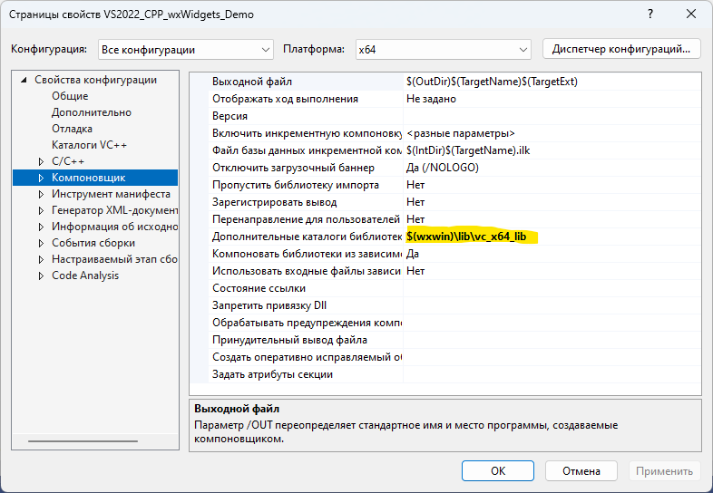

# VS2022_CPP_wxWidgets_Demo
Пример программы на C++ с использованием wxWidgets в Visual Studio 2022

https://github.com/wxWidgets/wxWidgets/releases/download/v3.2.3/wxWidgets-3.2.3.zip

https://github.com/wxFormBuilder/wxFormBuilder/releases/download/v3.10.1/wxFormBuilder-3.10.1-x64.exe


```
$(wxwin)\include\msvc;$(wxwin)\include
```


```
$(wxwin)\lib\vc_lib
```


```
$(wxwin)\lib\vc_x64_lib
```
**Для запуска на другом компьютере там сперва нужно установить MS Visual C++ Redistributable packages:**

*Для x32-программ:* https://aka.ms/vs/17/release/vc_redist.x86.exe

*Для x64-программ:* https://aka.ms/vs/17/release/vc_redist.x64.exe
