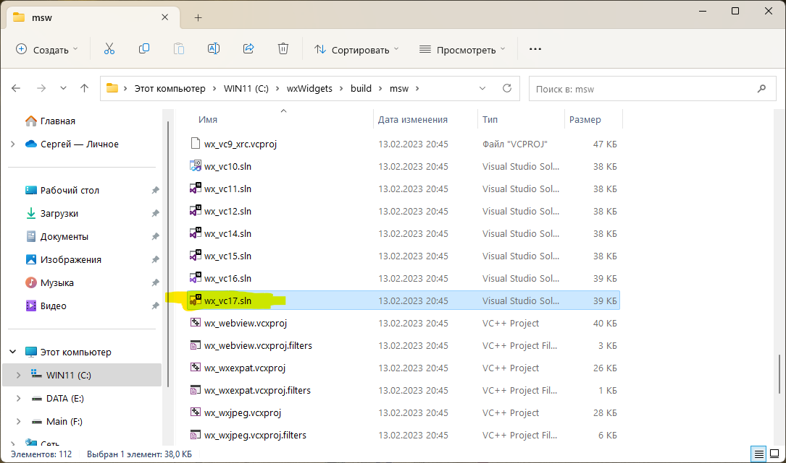
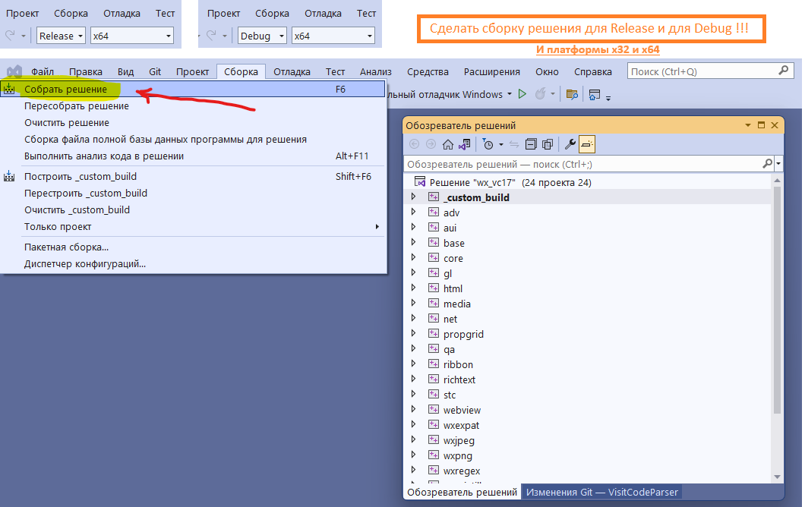
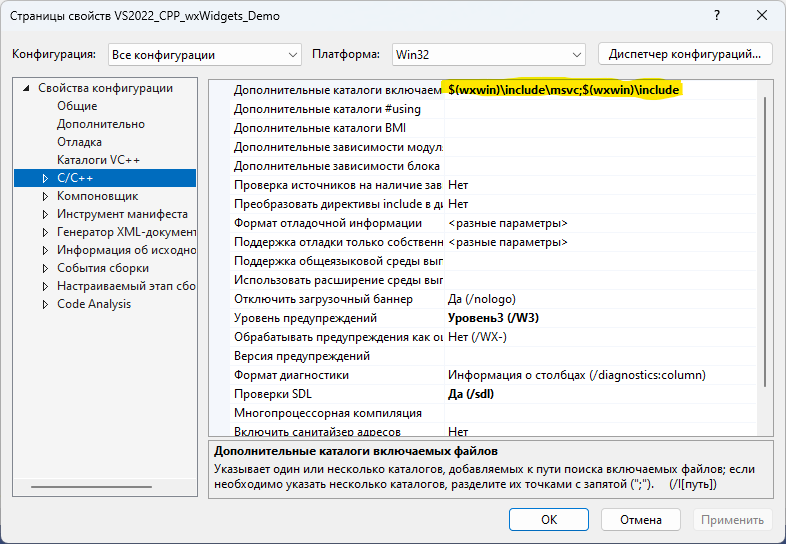

# VS2022_CPP_wxWidgets_Demo
Пример программы на C++ с использованием wxWidgets в Visual Studio 2022

https://github.com/wxWidgets/wxWidgets/releases/download/v3.2.2.1/wxWidgets-3.2.2.1.zip

https://github.com/wxFormBuilder/wxFormBuilder/releases/download/v3.10.1/wxFormBuilder-3.10.1-x64.exe








```
$(wxwin)\include\msvc;$(wxwin)\include
```


```
$(wxwin)\lib\vc_x64_lib
```


